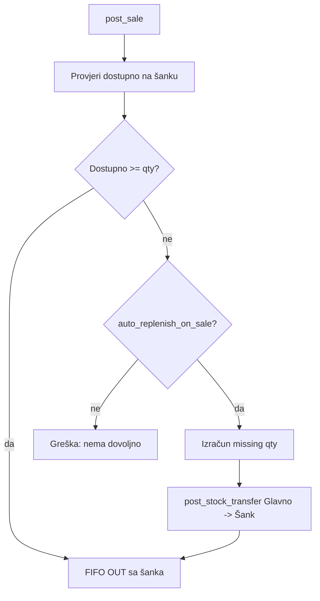
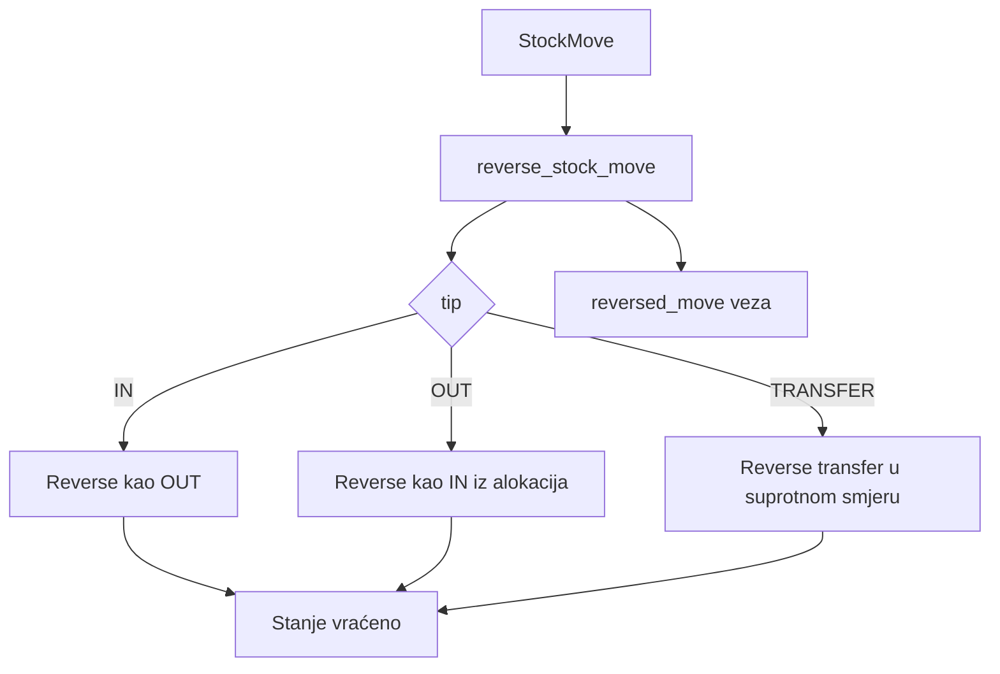

# Mermaid dijagrami

> Modul: Dijagrami
> Ovisi o: —
> Koriste ga: Svi

## Sadržaj
- [1) Nabava: Primka → FIFO IN → Ulazni račun → Knjiženje](#1-nabava-primka-→-fifo-in-→-ulazni-racun-→-knjizenje)
- [2) Plaćanje dobavljača (DEFERRED)](#2-placanje-dobavljaca-deferred)
- [3) Prodaja: FIFO OUT → Auto COGS → Financijska prodaja](#3-prodaja-fifo-out-→-auto-cogs-→-financijska-prodaja)
- [4) Auto-replenish pri prodaji](#4-auto-replenish-pri-prodaji)
- [5) Transfer Glavno → Šank (FIFO)](#5-transfer-glavno-→-sank-fifo)
- [6) Storno robnog dokumenta](#6-storno-robnog-dokumenta)


Ovdje su dijagrami glavnih tokova. Možeš ih kopirati u README ili pojedine `.md` fileove.

---

## 1) Nabava: Primka → FIFO IN → Ulazni račun → Knjiženje

```mermaid
flowchart TD
  A[WarehouseInput (Primka)] --> B[Akcija: Proknjiži primku u skladište]
  B --> C[StockMove IN]
  C --> D[StockMoveLine (iz stavki primke)]
  D --> E[StockLot (FIFO slojevi)]

  A --> F[Akcija: Kreiraj ulazni račun iz primki]
  F --> G[SupplierInvoice]
  G --> H{payment_terms}
  H -->|CASH| I[Knjiženje: D trošak + D pretporez + D depozit / P cash]
  H -->|DEFERRED| J[Knjiženje: D trošak + D pretporez + D depozit / P AP]
  I --> K[JournalEntry POSTED]
  J --> K
  G -.veže.-> A
  K -.link.-> G
```

---

## 2) Plaćanje dobavljača (DEFERRED)

```mermaid
flowchart TD
  A[SupplierInvoice DEFERRED] -->|UNPAID/PARTIAL| B[User poveća paid_amount]
  B --> C[Save (change form)]
  C --> D[post_supplier_invoice_payment]
  D --> E[JournalEntry plaćanja]
  E --> F[D AP / P payment_account]
  F --> G{je li zatvoreno?}
  G -->|ne| H[payment_status = PARTIAL]
  G -->|da| I[payment_status = PAID]
```

---

## 3) Prodaja: FIFO OUT → Auto COGS → Financijska prodaja

```mermaid
flowchart TD
  A[Sale lines (artikl, qty)] --> B[post_sale]
  B --> C[post_stock_out purpose=SALE]
  C --> D[StockMove OUT]
  D --> E[StockAllocation (FIFO)]
  E --> F[Auto COGS]
  F --> G[JournalEntry COGS]
  G --> H[D COGS / P Inventory]

  B --> I[post_sales_cash]
  I --> J[JournalEntry Sales]
  J --> K[D cash / P revenue / P VAT]

  D -.journal_entry.-> G
  D -.sales_journal_entry.-> J
```

---

## 4) Auto-replenish pri prodaji



---

## 5) Transfer Glavno → Šank (FIFO)

```mermaid
flowchart TD
  A[post_stock_transfer] --> B[FIFO OUT iz from_warehouse]
  B --> C[StockAllocation (lotovi + cost)]
  C --> D[Lotovi u to_warehouse]
  D --> E[qty_remaining u from smanjen]
  D --> F[qty_remaining u to povećan]
```

---

## 6) Storno robnog dokumenta



[← Back to index](../index.md)